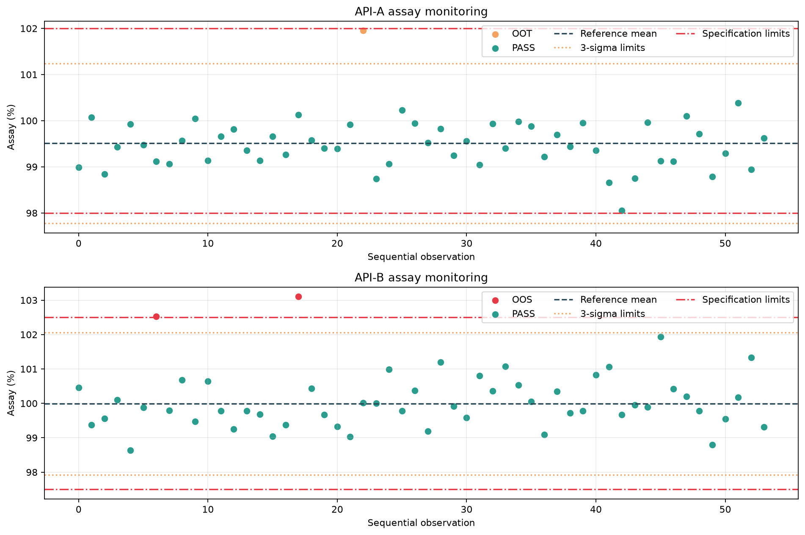

# Pharmaceutical QC Data Analytics Pipeline

An end-to-end portfolio project that demonstrates how Python and SQL can support pharmaceutical quality-control trending, data validation, OOS/OOT identification, and reproducible reporting.

> **Data statement:** All records in this repository are synthetic. The workflow is inspired by common pharmaceutical QC activities, but it does not contain confidential employer, product, patient, or batch data.

## Business question

QC teams need to review analytical results consistently, distinguish specification failures from statistical trend signals, and retain traceable records for investigation. Manual spreadsheet workflows can make validation, trending, and repeatability difficult.

This project answers:

- Which individual results and batches require investigation?
- Are results outside registered specifications (OOS) or only outside statistical control limits (OOT)?
- How do batch means change over time?
- Do instruments show different rates of flagged results?

## Sample output



## What the pipeline does

1. Generates a reproducible synthetic assay dataset.
2. Validates required fields, unique sample IDs, dates, numeric types, replicates, and specification limits.
3. Calculates product-level reference means and 3-sigma control limits from in-spec observations.
4. Classifies results as `PASS`, `OOT`, or `OOS` without deleting the original record.
5. Produces batch-level summaries and control charts.
6. Writes raw, analysed, summary, and limit tables to SQLite.
7. Provides SQL examples using CTEs, conditional aggregation, and window functions.
8. Tests reproducibility, schema validation, known OOS behaviour, and record preservation.
9. Provides an interactive Streamlit dashboard with filters, KPIs, investigation tables, and CSV export.

## OOS and OOT definitions used in this demonstration

- **OOS:** result outside its lower or upper specification limit.
- **OOT:** result within specification but outside the calculated 3-sigma control limits.

These simplified rules are for portfolio demonstration only. In a regulated environment, approved procedures, scientifically justified reference populations, method capability, investigation procedures, and quality-unit oversight would govern decisions. A statistical flag is not automatically proof of laboratory error or product failure.

## Repository structure

```text
pharma-qc-analytics-pipeline/
|-- data/                         # Generated synthetic input
|-- outputs/                      # Generated database, CSVs, and charts
|-- sql/
|   `-- analysis_queries.sql
|-- src/
|   |-- generate_data.py
|   `-- qc_pipeline.py
|-- tests/
|   `-- test_qc_pipeline.py
|-- run_pipeline.py
|-- requirements.txt
`-- README.md
```

## Run locally

```bash
python -m pip install -r requirements.txt
python run_pipeline.py
pytest -q
streamlit run dashboard.py
```

Generated outputs:

- `outputs/analysed_results.csv`
- `outputs/batch_summary.csv`
- `outputs/pharma_qc.db`
- `outputs/control_charts.png`

The Streamlit command opens an interactive dashboard for filtering products and QC status, reviewing flagged results, and exporting a selected dataset.

## Skills demonstrated

- Python: pandas, NumPy, modular functions, validation, testing
- SQL: SQLite, CTEs, joins-ready relational tables, conditional aggregation, window functions
- Statistics: descriptive statistics and 3-sigma monitoring
- Pharmaceutical domain: specifications, OOS/OOT distinction, traceability, QC trending
- Data communication: batch summaries and control charts

## Validation and limitations

- Fixed random seeds make generated data and visual outputs reproducible.
- Tests confirm that records are retained and deliberately injected OOS results are detected.
- Control limits are estimated from a small synthetic reference population and are not qualified for operational GMP use.
- The example does not replace an approved analytical procedure, validated software, or formal OOS/OOT investigation.

## Authorship and AI assistance

The pharmaceutical problem definition, QC interpretation, decision requirements, and review of outputs are domain-led. AI-assisted development was used for code scaffolding, debugging, documentation, and test suggestions. All logic should be understood, reviewed, and explainable by the project owner before it is presented in an interview.
